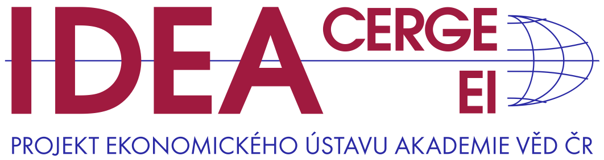

::: {custom-style="IDEA tiráž"}
{width="4.06in"}

*Interaktivní aplikace/2026*  
:::

::: {custom-style="IDEA hr"}
&nbsp;
:::

::: {custom-style="IDEA Title"}
Zaměstnanci státu a jejich platy v roce 2025:\
pád relativních platů se zastavil.[^1]
:::

::: {custom-style="IDEA tiráž"}
[Červen 2026]{.smallcaps}

[Petr Bouchal, Taras Hrendaš^\*^, Daniel Münich^\*^]{.smallcaps}  
:::

::: {custom-style="IDEA hr"}
&nbsp;
:::

# Shrnutí klíčových poznatků

- Srovnávací analýza představuje každoroční aktualizaci vývoje počtu zaměstnanců státu, jejich platů a nákladů na ně v roce 2025 a to na základě údajů [Státního závěrečného účtu](https://www.mf.gov.cz/cs/rozpoctova-politika/statni-rozpocet/plneni-statniho-rozpoctu)^[https://www.mf.gov.cz/cs/rozpoctova-politika/statni-rozpocet/plneni-statniho-rozpoctu].
- Počet zaměstnanců státu vzrostl o zhruba 4 000 (+0,8 %), přibylo především zaměstnanců ve školství a v armádě. Státních úředníků naopak zhruba o 300 ubylo (-0,4 %).
- Průměrné platy v reálém vyjádření ve skupině *státních úředníků* poprvé od roku 2020 vzrostly. Vývoj platů zhruba kopíroval vývoj mezd v celé ekonomice a tedy se zastavilo delší období oslabování platové konkurenceschopnosti státních úřadů.
- V širším sektoru zaměstnanců státu pak vzrostla platová konkurenceschopnost v oblasti armády a příslušníků bezpečnostních sborů. Mírně naopak opět poklesla u zaměstnanců v regionálním školství.
- Mnoho dalších informací poskytuje **[on-line aplikace](https://ideaapps.cerge-ei.cz/zamestnancistatu/)**. Ta letos uživatelům nově nabízí interaktivní nástroj analýzy dlouhodobých trendů. 

## Kdo jsou zaměstnanci státu

- **Za zaměstnance státu považujeme** ty, jejichž zaměstnanost reguluje a financuje státní rozpočet (SR). Těch je téměř půl milionu.
  To představuje necelých 10 % české pracovní síly.
  Zdaleka největší podíl představují zaměstnanci v regionálním školství (cca 290 tisíc), bezpečnostních sborů (cca 80 tisíc) jako jsou policie, hasiči, celní správa, vězeňská služba a v armádě.

  ::: {custom-style="nospacepara"}
  [Graf 1a](https://ideaapps.cerge-ei.cz/zamestnancistatu/#1a.Po%C4%8Dtyzam%C4%9Bstnanc%C5%AF) 

  [Graf 2a](https://ideaapps.cerge-ei.cz/zamestnancistatu/#2a.Po%C4%8Dtyzam%C4%9Bstnanc%C5%AF) 
  :::

## Počty zaměstnanců státu

- **Celkový počet zaměstnanců státu v roce 2025** vzrostl o cca 4 000 osob (0,6 %)

  ::: {custom-style="nospacepara"}
  [Graf 10](https://ideaapps.cerge-ei.cz/zamestnancistatu/#10.Zm%C4%9Bnypo%C4%8Dtuzam.podlekategori%C3%AD) 
  :::

  - Počet státních úředníků velmi mírně klesl (o 300 osob, 0.3 %); mírné nárůsty na ústředních úřadech více než kompenzovaly úbytky zaměstnanců velkých neústředních úřadů.

  - Počet zaměstnanců ministerstev vzrostl o zhruba 300.

  - Počet zaměstnanců ostatních ústředních orgánů vzrostl o zhruba 50 (+1 %).

  - Výrazně přibylo zaměstnanců regionálního školství zhruba o 3 800 (+1,4 %).

- **Sektor školství spadající pod MŠMT (příspěvkové organizace) za poslední dekádu přispěl k celkovému nárůstu počtu zaměstnanců státu nejvíce.** Od roku 2017 se meziroční nárůsty pohybovaly mezi 3,8 až 14,9 tisíci zaměstnanců, což ale s ohledem na celkově vysoké počty zaměstnanců znamená růsty pouze v řádu 1 % až 3 %.
  Souviselo to jak s demograficky taženým růstem počtu dětí školního věku v tomto období, tak se zaváděním inkluze, která dříve v českém školství absentovala.

  ::: {custom-style="nospacepara"}
  [Graf 10](https://ideaapps.cerge-ei.cz/zamestnancistatu/#10.Zm%C4%9Bnypo%C4%8Dtuzam.podlekategori%C3%AD) 
  :::

- **Státních úředníků je mezi zaměstnanci státu cca 75 tisíc (15 % zaměstnanců státu)**.
  Většina z nich pracuje v ‚Neústřední státní správě', tj. v organizacích, jako jsou finanční úřady či správa sociálního zabezpečení, úřady práce, tedy často na pobočkách mimo Prahu.
  Na ministerstvech pak pracuje necelých 23 tis. osob, představují necelých 5 % zaměstnanců státu a necelého půl procenta pracovní síly v ekonomice (toto číslo zahrnuje i příslušníky a zaměstnance bezpečnostních sborů evidované na Ministerstvu vnitra (MV ČR), které nelze v těchto datech odlišit).
  Státních úředníků je tedy mnohem méně, než jaké jsou laické představy a případná očekávání ohledně rozsahu možných úspor v této oblasti.

  ::: {custom-style="nospacepara"}
  [Graf 1a](https://ideaapps.cerge-ei.cz/zamestnancistatu/#1a.Po%C4%8Dtyzam%C4%9Bstnanc%C5%AF) 

  [Graf 4a](https://ideaapps.cerge-ei.cz/zamestnancistatu/#4a.Po%C4%8Dtyzam%C4%9Bstnanc%C5%AF) 

  [Graf 4b](https://ideaapps.cerge-ei.cz/zamestnancistatu/#4b.Po%C4%8Dtyzam.,v%C4%8Detn%C4%9BMVaMZV) 
  :::

- **Počty státních úředníků** se poslední dvě dekády pohybovaly v rozmezí 71 tis. (rok 2012) a 79 tis. (rok 2019).
  Do dlouhodobých trendů se promítly snahy o konsolidaci veřejných rozpočtů po roce 2010 a po roce 2021.
  Za mírným poklesem počtu státních úředníků po roce 2021 o zhruba 3 000 stály hlavně poklesy v sektoru ‚Neústřední státní správy', která zahrnuje organizace podřízené ministerstvům jako např.
  finanční správa nebo úřady práce.
  ‚Neústřední státní správa' zaměstnává většinu státních úředníků (63 %).
  Naopak počet státních úředníků přímo na ministerstvech po roce 2021 mírně narostl z 22 729 na 23 130 v roce 2025 (toto číslo zahrnuje i příslušníky a zaměstnance bezpečnostních sborů evidované pod IČO Ministerstva vnitra, které nelze v těchto datech odlišit).

  ::: {custom-style="nospacepara"}
  [Graf 4b](https://ideaapps.cerge-ei.cz/zamestnancistatu/#4b.Po%C4%8Dtyzam.,v%C4%8Detn%C4%9BMVaMZV) 
  :::

- **Veřejný sektor, uváděný v některých statistikách ČSÚ**, představuje širší skupinu než jsou zaměstnanci státu, a navíc zahrnuje např. instituce veřejného zdravotnictví, veřejných vysokých škol a státní firmy.
  Zaměstnanost v takto definovaném sektoru dlouhodobě představuje zhruba 1 milion osob, tedy necelou pětinu pracovní síly v české ekonomice. Tento počet dlouhodobě mírně roste; v roce 2025 narostl o 14 tisíc (1,6 %) a za zhruba dvěma třetinami tohoto nárůstu stojí samosprávy, kde jsou započteny i nárůsty počtu zaměstnanců v regionálním školství. 
  K nárůstu v ústředním státu přispívá i mírný setrvalý růst počtu vojáků.

  ::: {custom-style="nospacepara"}
  [Graf 9a](https://ideaapps.cerge-ei.cz/zamestnancistatu/#9a.Po%C4%8Detzam.ve%C5%99.sektoru) 
  :::

## Platy zaměstnanců státu

- **Průměrné reálné platy státních úředníků v roce 2025 poprvé od roku 2020 zaznamenaly nárůst** (ministerstva, ostatní ústřední orgány, neústřední úřady).
  Platy na neministerských ústředních orgánech rostly (4,5 %) o něco rychleji než na neústředních úřadech (3,4 %) a ministerstvech (3,2 %). 
  K tomuto relativně rychlejším nárůstu v početně malé skupině zaměstnanců ostatních ústředních orgánů přispěl růst průměrného platu v Digitální a informační agentuře, spojený s nárůstem počtu jejích zaměstnanců. 
  Průměrné platy státních úředníků vůči průměrné mzdě v ekonomice ale opět poklesly– byť mírněji než v minulých letech – protože průměrná mzda v celé ekonomice rostla opět rychleji. 
  Nejvíce se propadly relativní mzdy na ministerstvech. Naopak se mírně zvýšily v ústředních orgánech, které je třeba srovnávat s platy v Praze. 
  Platová úroveň ministerstev a ústředních úřadů nyní dosahuje cca 95 % resp. 87 % pražského průměru, a to i přesto, že v těchto úřadech pracuje vyšší podíl např. vysokoškolsky vzdělaných lidí, než na celém trhu práce v Praze.

  ::: {custom-style="nospacepara"}
  [Graf 5a](https://ideaapps.cerge-ei.cz/zamestnancistatu/#5a.Vre%C3%A1ln%C3%A9mvyj%C3%A1d%C5%99en%C3%AD) 
  :::

- **Průměrné relativní platy státních úředníků**, tedy v poměru k průměrným platům v ekonomice, se poslední dvě dekády vyvíjely velmi cyklicky.
  Minima dosáhly v letech 2011--2012, maxima kolem roku 2018 a od té doby klesají.
  Letošní poklesy relativních platů ústředních úřadů a ministerstev přichází po ještě strmějších propadech v roce 2024 a následují dlouhodobý pokles, který začal v roce 2019.

  ::: {custom-style="nospacepara"}
  [Graf 5b](https://ideaapps.cerge-ei.cz/zamestnancistatu/#5b.V%C5%AF%C4%8Dipr%C5%AFm%C4%9Brn%C3%A9mzd%C4%9B) 
  :::

- **Průměrné reálné platy v sektoru státní správy v letech 2015--2018** svým vývojem převyšovaly růst průměrných reálných mezd v ekonomice.
  To přispělo k růstu relativních platů ve státní správě, a tedy i nákladů na tyto platy.
  V roce 2021 došlo k velkému propadu reálných platů ve státní správě, zatímco reálné mzdy v ekonomice ještě rostly.
  V letech 2022 a 2023 potom došlo k vysokým a podobným propadům reálných platů i mezd v ekonomice.
  V roce 2024 státní správa na ekonomiku dále ztrácela, v roce 2025 se tento propad téměř zastavil. Výjimkou jsou bezpečnostní sbory a skupina zahrnující Armádu ČR, kde relativní platy v roce 2025 stouply.

  ::: {custom-style="nospacepara"}
  [Graf 5a](https://ideaapps.cerge-ei.cz/zamestnancistatu/#5a.Vre%C3%A1ln%C3%A9mvyj%C3%A1d%C5%99en%C3%AD) 
  :::

- **Průměrné platy** se výrazně liší jak mezi kategoriemi organizací, tak mezi organizacemi uvnitř těchto kategorií.
  Naše srovnání založená na datech *Státního závěrečného účtu* ale nemohou zohlednit vzdělanostní a další rozdíly, které se do platů a mezd promítají, což je třeba u prezentovaných srovnání brát v úvahu.
  Srovnání platů a mezd, které zohledňuje rozdíly vykonávaných profesí, úrovně vzdělání, věku, pohlaví a regionu nabízí [studie IDEA (2025)](https://idea.cerge-ei.cz/studies/srovnani-platu-a-mezd-v-ceske-republice-vetsi-problem-nez-se-zda).

  ::: {custom-style="nospacepara"}
  [Graf 3a](https://ideaapps.cerge-ei.cz/zamestnancistatu/#3a.Absolutn%C3%ADhodnoty) 
  :::

- **Nejvyšší průměrné měsíční platy** měli v roce 2025 zaměstnanci ministerstev (62 tis. Kč), dále pak zaměstnanci ‚Ostatních ústředních orgánů' (56 tis. Kč).
  Široký rozptyl měly průměrné platy organizací zařazených do kategorie ‚Ostatní organizační složky státu', což odráží velkou rozmanitost funkcí a personálního složení těchto organizací.
  Nejnižší platy pak mají zaměstnanci ‚Neústřední státní správy', tedy převážně organizací poskytujících přímé služby občanům.

  ::: {custom-style="nospacepara"}
  [Graf 3a](https://ideaapps.cerge-ei.cz/zamestnancistatu/#3a.Absolutn%C3%ADhodnoty) 
  :::

- **Průměrné platy zaměstnanců ministerstev** (sídlících většinou v Praze) se liší od průměrné mzdy v Praze v rozpětí +5/-15 % (vyšší je rozdíl u MZV, kde je systém odměňování specifický).
  Přesné důvody této platové nerovnosti nelze z dostupných dat vysledovat.
  Obecně ale hraje roli rozdílné personální složení co do odbornosti i věkové struktury a také zřejmě historicky dané rozdíly, které systém rozpočtování a platové politiky jednotlivých úřadů v průběhu času zachovávají.

  ::: {custom-style="nospacepara"}
  [Graf 3a](https://ideaapps.cerge-ei.cz/zamestnancistatu/#3a.Absolutn%C3%ADhodnoty) 
  :::

## Výdaje na platy zaměstnanců státu

- **Výdaje na platy zaměstnanců státu** regulované státním rozpočtem (SR) v roce 2025 činily 284 miliard Kč, což představuje 12 % výdajů státního rozpočtu a 3,3 % HDP.
  Rozložení nákladů mezi jednotlivé oblasti zaměstnanosti zhruba odpovídá počtům tam pracujících zaměstnanců státu.

  ::: {custom-style="nospacepara"}
  [Graf 1b](https://ideaapps.cerge-ei.cz/zamestnancistatu/#1b.V%C3%BDdajenaplaty) 
  :::

- **Výdaje na platy státních úředníků** v roce 2025 činily zhruba 43,5 mld. Kč, což představuje 1,8 % státního rozpočtu a 0,51 % HDP.
  Náklady na platy úředníků ministerstev (opět včetně všech osob na MV ČR) představovaly 17,3 mld. Kč, tedy 38 % celkových nákladů na úředníky státu (bez bezpečnostních sborů uvnitř MV ČR odhadem 10 mld., tedy 22 % nákladů na státní úředníky).

  ::: {custom-style="nospacepara"}
  [Graf 1b](https://ideaapps.cerge-ei.cz/zamestnancistatu/#1b.V%C3%BDdajenaplaty) 
  :::

- **Nominální výdaje na platy státních úředníků poslední dvě dekády,** kromě let 2010 a 2011, rostly.
  To je přirozené s ohledem na průběžnou inflaci, a hlavně průběžný růst nominálních platů v ekonomice.
  Výdaje nejvíce rostly v období let 2012 až 2019, kdy růst platových nákladů odrážel jak růst počtu zaměstnanců, tak reálných průměrných platů (po zohlednění inflace).
  Nárůst nominálních výdajů po roce 2021 byl tažen snahou alespoň částečně kompenzovat inflaci a omezovat výrazný pokles reálné hodnoty platů.

  ::: {custom-style="nospacepara"}
  [Graf 4c](https://ideaapps.cerge-ei.cz/zamestnancistatu/#4c.V%C3%BDdajenaplaty) 
  :::

- **Reálné výdaje na platy státních úředníků,** tedy ve stálých cenách, poslední dvě dekády výrazně fluktuovaly.
  K nejrychlejšímu poklesu došlo po roce 2021 v důsledku inflační vlny a snahy o konsolidaci výdajů SR.
  V roce 2025 tak byly výdaje v reálném vyjádření na platy cca o 2 mld. vyšší než v roce 2009, tedy před světovou finanční krizí.
  V mezidobí však výrazně narostla reálná hodnota HDP i příjmů a výdajů SR.

  ::: {custom-style="nospacepara"}
  [Graf 5a](https://ideaapps.cerge-ei.cz/zamestnancistatu/#5a.Vre%C3%A1ln%C3%A9mvyj%C3%A1d%C5%99en%C3%AD) 
  :::

[^1]: Interaktivní aplikace/studie think-tanku IDEA při Ekonomickém ústavu Akademie věd ČR nabízí podrobné analytické vhledy do struktury a dlouhodobých trendů počtu zaměstnanců státu, výše jejich platů a výdajů na ně.
    Aplikace je veřejně dostupná na adrese: <https://ideaapps.cerge-ei.cz/zamestnancistatu> a reprezentuje pouze názor autorů, nikoli oficiální stanovisko Ekonomického ústavu AV ČR, v.v.i. či Centra pro ekonomický výzkum a doktorské studium UK (CERGE).

    \* CERGE-EI, společné pracoviště UK a EKÚ AV ČR, v.v.i.
